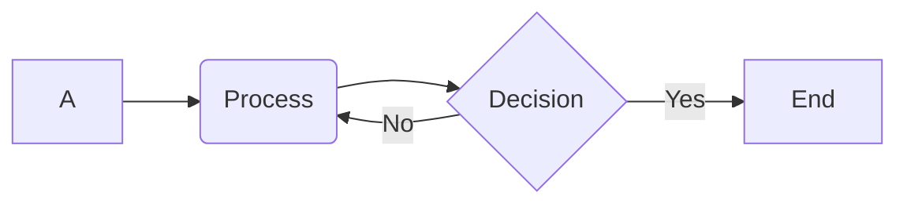
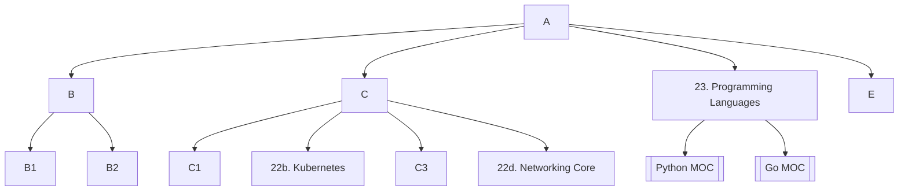

## General
### Principle `local first`

### Core Concepts

- Vault
- Notes
- Links
- Graph View
	- Global Graph
	- Local Graph

### Hybrid PKM Framework
1. PARA and Zettelkasten 
	- **Zettelkasten**: atomic notes + bi-directional linking
	- **PARA** (Project, Area, Resources, Archive) 
2. Folder Structure
	* Inbox/Drafts
	* Projects
	* Areas/Domain
	* Resources
	* Knowledge Snippets
	* Archive

### Markdown syntax

- Code blocks, syntax highlighting, tables
- Callouts (or Admonitions): 
	- `>[!type]`
	- type: note, warning, danger, success, bug, tip

> [!note] this is note 

> [!warning] this is warning

> [!bug] this is bug


## Tech Content Design 
### Naming convention
1. Tags (Note Type)
```
#type/runbook
#type/conceptual
#status/deprecated
```
2. Links (Topic) -> create Map of Content (MOCs)
3. Map of Content (MOCs)

### The Knowledge Base Triad
1.  Conceptual Note (atomic)
2.  Snippet Note (Script/Code)
3.  Runbook/Troubleshooting Note

### Automate with **Templater** and Metadata
- Templater Plugin: embedded var and func and execute js into note 
	-> automate by using Moment.js via Templater
- Metadata (Properties): YAML Frontmatter of each notes -
	-> using to query TKB (technical knowledge base)
	- type: conceptual, runbook, ...
	- domain: connect with MOC or knowledge domain
	- environment
	- version
	- status
### Mermaid diagrams


## Plugin + Project management 
### Dataview
### Kanban
### Git
### Digital Garden




